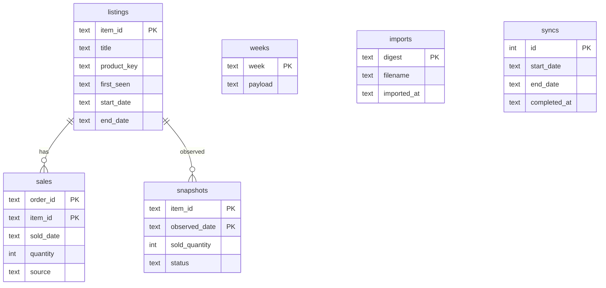

# Data model and pipeline

The initial field inspection and pipeline draft preceded implementation. No customer
reports or credentials were present. The user's subsequent clarification made direct
eBay downloads the primary workflow; file import is an optional historical backfill.
Existing deleted Next.js scaffold files were unrelated and were not restored.

## Inspected sources

- [eBay Seller Hub report guide](https://ir.ebaystatic.com/cr/v/c1/rsc/feeds/v1/guide-downloadable-reports.pdf)
- [Seller Hub order CSV fields](https://ocsnext.ebay.com/help/selling/selling-tools/seller-hub?id=4095)
- [Fulfillment order discovery](https://developer.ebay.com/api-docs/sell/static/orders/discovering-unfulfilled-orders.html)
- [Fulfillment getOrders](https://developer.ebay.com/api-docs/sell/fulfillment/resources/order/methods/getOrders)
- [Trading GetMyeBaySelling](https://developer.ebay.com/Devzone/XML/docs/Reference/eBay/GetMyeBaySelling.html)
- [Seller OAuth](https://developer.ebay.com/develop/guides/sell/authorization)
- [OpenAI structured outputs](https://developers.openai.com/api/docs/guides/structured-outputs)
- [GPT-5.6 alias](https://developers.openai.com/api/docs/models/gpt-5.6-sol)

The direct Fulfillment reference could not be fetched by the browsing tool during
inspection; the official order-discovery guide supplied filter/coverage documentation.
Actual account payloads still require credentialed verification.

## Fields and sources

| Source | Fields used | Meaning |
|---|---|---|
| Fulfillment orders | orderId, creationDate, lineItems.lineItemId, legacyItemId, sku, title, quantity, cancelStatus.cancelState | Dated ordered units |
| Trading ActiveList/UnsoldList | ItemID, Title, SKU, SellingStatus.QuantitySold, ListingDetails.StartTime/EndTime, pagination | Unsold denominator, listing exposure and audit snapshots |
| Orders CSV/XLSX | Item Number, Item Title, Order Number, Transaction ID, Quantity, Sale Date, Custom Label | Historical backfill |
| Listings CSV/XLSX | Item number, Title, Custom label, Sold quantity, explicit snapshot date | Historical listing observations |

Available quantity is inventory, never sales. Sold quantity in listing reports is a
cumulative counter, not a weekly delta. Orders and snapshots must not be summed.
GetMyeBaySelling covers all active listings and at most 60 days of ended-unsold listings;
its 25,000-item cap is detected and fails rather than silently truncating. Order downloads
use a 90-day configurable lookback and independently refresh recently modified orders.
This refresh can retrieve older orders whose cancellation/status changed recently.

## SQLite model

Identifiers remain text. Variations aggregate at parent-listing level. The seller's
sourcing tool writes SKUs as an 8-hex prefix plus the base64 Amazon ASIN; when that decodes
to a valid ASIN the product key is `asin:<ASIN>`, otherwise parent SKU, otherwise normalized
title. An ASIN key upgrades an earlier proxy (order rows can carry the item ID as SKU);
otherwise the first observed title and product identity remain stable. `connect()` migrates
older databases (new date columns, `sku:` → `asin:` keys) idempotently. Active listings'
scheduled EndTime is ignored; only ended listings store an end date.
No buyer details, prices, revenues or profit are persisted or sent to GPT.

API refreshes are atomic across orders and listings. Missing pages or API errors abort
before database mutation. Sale identity is order + parent item; transaction quantities
within a full order/listing are summed once. API quantity corrections overwrite that
observation. File overlaps are idempotent and conflicting quantities are rejected.
Snapshots are audit-only and never provide guessed dated sales.

## Pipeline

1. Refresh seller OAuth token. Download all pages of orders and active/unsold listings.
   Normalize and commit the complete batch. Export sanitized source CSVs locally.
2. Compute listing units in Python over the last `analysis_days` (90): total, recent and
   prior windows, excluding future dates, plus days live inside the window from listing
   start/end dates (whole window when unknown). Windows are UTC calendar days, inclusive.
3. Split titles into segments (`|`, commas, parentheses, spaced dashes; drop a word cut off
   by `...`) and extract contiguous 1–3 token phrases per segment. Letter+digit model codes
   (F150, RAV4, CR-V) count when seen across 5+ products; rarer ones are part numbers.
   Single words must be model codes or on the curated make/model allowlist (plus OEM).
   Quantities/sizes, numbers and stopwords are boundaries. Group plural/reordered/hyphen variants under one canonical key and display
   the most common literal spelling.
4. Aggregate candidate total/recent/prior units, successful/unsold listings, ASIN breadth,
   mean/median, success rate, exposure and largest-product share. Apply support thresholds
   and concentration. Compute smoothed sell-through
   lift versus the store and drop keywords below the store average. Trend compares the
   keyword's share of store units (insufficient_data under 4 units). Score is quantity-led
   with a log-lift term.
5. Deduplicate only true variants: a nested phrase on identical listings replaces the
   shorter fragment. Different products whose sales overlap (ignition coil, spark plugs)
   both stay, because each reaches different Amazon listings; the seller prefers reach
   over overlap avoidance. Keep up to 200 candidates.
   Never pad a sparse pool to meet a numeric target.
6. Assign tiers: Proven (5+ units, topped up to 7 distinct by promotion) and Explore (the
   rest, ranked by `explore_score`, the score without its total-volume term). Explore
   candidates carry `outside_proven_share`. Explore keywords recommended in the last 4
   weeks rest; the least recently explored return if the pool runs short.
7. Give the configured model (GPT-5.4-mini) the Proven and Explore candidates separately,
   with examples and the last 8 weeks' keywords, tiers and results (new listings started
   that week containing the keyword, sold count, units). Treat all product titles as
   untrusted data. GPT chooses literal Amazon-title plausibility, semantic breadth and each
   Explore pick's market (`new_category`/`new_niche`), not arithmetic.
8. Validate strict JSON of keyword, reason, confidence (and market for Explore): the first 7
   valid picks per tier that are known, in the right tier, not resting, nonredundant across
   both tiers, with at least 4 `new_category` Explore picks. Python joins all statistics.
   Retry invalid choices twice; on repeated failure or refusal publish the per-tier
   fallback, marked `selection_method: fallback`. Too few candidates fails without
   publishing. Determine NEW, RETAINED, RETURNING and DROPPED using earlier saved weeks.
   Day N pairs Proven #N with Explore #N. Persist the complete result with config and
   candidate facts before exports.
9. Reuse saved results for same-week reruns; explicit --refresh regenerates. Atomically
   replace each output file. Recovery after interrupted exports uses stored week JSON.

## Practical limits

Statistical support thresholds are heuristics, not significance tests. Zero units means
no measured orders in accumulated history. CSV date completeness is unknown; reports
expose observed dates and successful API sync coverage. Today's window may be partial.
Quantities exclude fully canceled orders but are not net of returns/partial cancellations.
Past unsold inventory outside eBay's retention period cannot be reconstructed automatically.
Snapshots alone cannot establish recent transaction volume. Shared SKUs improve product
identity; identical-title grouping may undercount truly distinct products. Run one worker
at a time and use a separate database for each seller account and environment.

## Design decisions

- **Low thresholds, labeled evidence.** Stores with modest volume produce few keywords with
  5+ units, so candidates need only 2 units across 2 selling listings and products (with a
  75% concentration cap). Candidates under 5 units carry a `limited_volume` label, and the
  analysis exports its filter funnel on every run.
- **Product identity by ASIN** (decoded from the SKU where possible), so relisted copies of
  one product don't count as separate products.
- **Sell-through lift in the score and as a gate**, so keywords whose existing listings sell
  below the store average aren't sourced further.
- **Model codes** (F150, RAV4) are kept when shared by several products. Plain single words
  are limited to a curated make/model allowlist; allowing every single word led GPT to pick
  fragments such as "plug" and "nuts".
- **Trend** compares a keyword's share of store sales, so catalog growth alone isn't "rising".
- **Proven / Explore tiers.** Each day pairs one Proven keyword (large ASIN pull) with one
  Explore keyword (small test pull). At typical dropshipping sell-through, a small test needs
  60–90 days to read, so Explore keywords rest for 4 weeks after a test instead of repeating
  weekly. At least 4 of 7 Explore picks must be new categories; a text-overlap share cannot
  tell categories apart, so GPT labels each pick's market and Python enforces the minimum.
